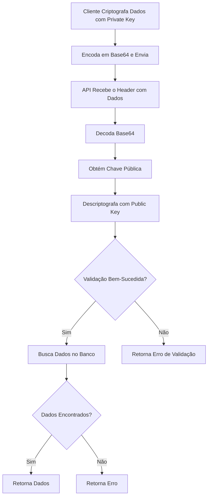
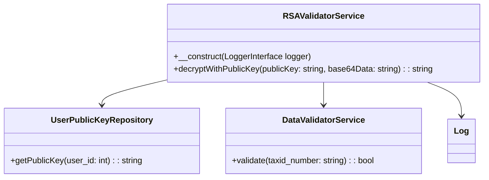

# Implementar Pacote para Laravel para Descriptografia de Dados com (Private Key e Public Key)

Implementar um sistema que permita descriptografar e validar dados utilizando a chave pública de clientes.

## Componente Laravel

Como vamos tornar esta implementação em um componente para Laravel para ser reutilizado em outras aplicações de forma simples, sendo assim precisamos pensar em:

- Estrutura do Pacote;
- Arquivo composer.json
- Configuração: config/rsa-validator.php
- Facade: Facades/RSAValidator.php
- Testes
- Publicação do Pacote
  - Empacotar com Composer:
  - Instalação em um Projeto Laravel:
  - Configuração no Laravel:
- Documentação em markdown para Github

> Analise outras necessidades que o pacote deve ter para possa ser publicado no [packagist.org](https://packagist.org/)

## Descrição de Funcionamento

O cliente criptografa informações (`CPF/CNPJ` ou outro dados conforme necessário concatenado com `:` e `timestamp`) utilizando sua chave privada, envia os dados para a API (encodado em Base64) no header da solicitação.

A API decoda o base64 e descriptografa utilizando a chave pública previamente armazenada em uma tabela no banco de dados (o nome desta tabela vai depender de cada aplicação, porem a aplicação deverá ter uma coluna com esta chave salva, caso a aplicação opte em salvar a chave em um diretório, este deverá ser informado, e neste caso não iremos buscar a chave no banco e sim no diretório, a classe deve tratar este processo). A API verifica se os dados estão disponíveis no banco e retorna uma resposta com base no resultado.

A implementação deve seguir princípios SOLID e boas práticas de design patterns.

### O fluxo geral:

- Cliente gera a private key e public key em sua maquina;
- Cliente nos envia sua public key;
- A API/Aplicação salva os valores da public key em uma tabela em seu banco de dados ou em um pasta definida pela aplicação.

Uma vez que ambas as pontas tem as chaves, podemos seguir o exemplo:

- Cliente usando sua private key criptografa `CPF/CNPJ:timestamp` de um usuário seu;
- Encoda em base64 esta criptografia;
- Envia para o endpoint da nossa API o base64 gerado, este valor será enviado no header juntamente com o client_id (valor que indicifica de quem é esta chave na aplicação);
- A API recebe o data;
- A API:
  - Decoda o base64 recebido;
  - Usando a chave publica tenta descriptografa o data;
    - Se a descriptografia falhar;
      - Informa que não foi possível efetuar a validação com a chave privada e chave pública
    - Se a descriptografia passar;
      - Verifica se o valor do data enviado esta disponível em nosso sistema;
        - Se esta disponível retorna os dados que foram solicitados no endpoint
        - Se os dados não existirem, retorna a mensagem informando que os dados o `CPF/CNPJ` não existe na API.

```
Obs.: Nos gráficos data = dados_unicos_do_user:timestamp
```

## Fluxograma Geral proposto



## Diagrama de Classes proposto



## No Github

Foi criado um repositório publico no GIT em https://github.com/Inovanti-Bank/rsa-validator, este branch que ao final será usado para publicar o pacote no [packagist.org](https://packagist.org/) para permitir a instalação via composer.
Com a descrição: Package for validation and decryption using RSA public keys (Private Key and Public Key).

Foram criadas 3 branchs

- production
- developer
- staging

> Novas branchs podem e devem ser criadas para a faze de desenvolvimento para que possa ter mais controle sobre o código, facilitando a restauração de algo.

## Servidor de desenvolvimento

O servidor local estará em um ambiente Windows com WSL2 e Nginx, PHP8.2 (mais o pacote pode trabalhar com PHP ^8.0) e PostgreSQL, então todo o processo de desenvolvimento e testes deve ser pensado para esta configuração.
A pasta local onde ficará o desenvolvimento será `/var/www/html/rsa-validator`, já foi clonado o projeto inicial do GIT com o básico que o GIT disponibiliza ao criar um novo repositório.

## Ponto de partida

Sendo assim, crie este processo, tudo que será necessário para que a equipe de desenvolvimento tenha facilidade no entendimento de como deve proceder com os código.

Utilize exemplos de códigos com um classe como RSAValidatorService (se necessário, pode substituir o nome por outro que tenha mais a ver com o proposito).

Também crie fluxogramas e diagramas de classes em mermaid para facilitar o entendimento.

Para o ClickUp, crie uma descrição bem como as tarefas e sub-tarefas para serem disponibilizadas para os programadores.
